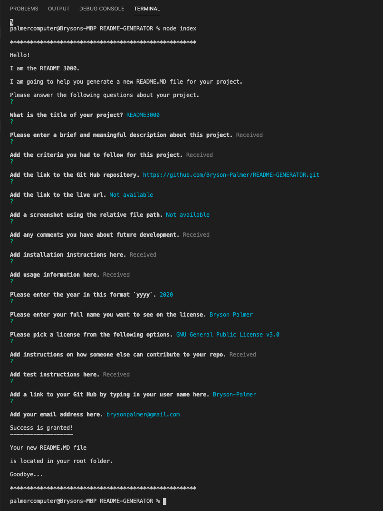

## <a id='back-to-top' > </a>
  # README3000   [](https://www.gnu.org/licenses/gpl-3.0)


This is a simple program that dynamically generates a README.MD file. You can either answer all the prompts fully and have a complete README file produced or you can enter through the prompts and create a template to fill in at a later time. There are 16 prompts for the user to answer. This is all built with `javascript` and running in the  `node.js` environment. This application is dependent on using the **inquirer** and `fs` npms. This program includes dynamically generated license badges, icons, clickable table of contents, and links. Try it out and see if you can't save yourself some time. Now you can spend that much more time coding!!!

  

  ## Table of Contents
  [Criteria](#criteria) </br>
  [Links](#links) </br>
  [Screenshot](#screenshot) </br>
  [Future Development](#future-development) </br>
  [Installation](#installation) </br>
  [Usage](#usage) </br>
  [License](#license) </br>
  [Contributing](#contributing) </br>
  [Tests](#tests) </br>
  [Questions](#questions) </br>

  ## 💼 <a id='criteria'></a> Criteria
  ```
 
GIVEN a command-line application that accepts user input
WHEN I am prompted for information about my application repository
THEN a high-quality, professional README.md is generated with the title of my project and sections entitled Description, Table of Contents, Installation, Usage, License, Contributing, Tests, and Questions
WHEN I enter my project title
THEN this is displayed as the title of the README
WHEN I enter a description, installation instructions, usage information, contribution guidelines, and test instructions
THEN this information is added to the sections of the README entitled Description, Installation, Usage, Contributing, and Tests
WHEN I choose a license for my application from a list of options
THEN a badge for that license is added near the top of the README and a notice is added to the section of the README entitled License that explains which license the application is covered under
WHEN I enter my GitHub username
THEN this is added to the section of the README entitled Questions, with a link to my GitHub profile
WHEN I enter my email address
THEN this is added to the section of the README entitled Questions, with instructions on how to reach me with additional questions
WHEN I click on the links in the Table of Contents
THEN I am taken to the corresponding section of the README

  ```

  ## 🔗 <a id='links'></a> Links
  Link to [**GitHub**](https://github.com/Bryson-Palmer/README-GENERATOR.git) </br>
  Live **URL** for [**README3000**](https://drive.google.com/file/d/1M4HJI3aRnQ6CG1QeC5LFFuKOqxt4TpwQ/preview) </br>
  

  ## 📸 <a id='screenshot'></a> Screenshot
  

  ## 🔍 <a id='future-development'></a> Future Development

I would like to have some tests built for this program.

I would also like to utilize the `validate` and `when` properties of the prompts in order to get more dynamic and user oriented data. For example, firing off an additional prompt `when` the user answers a question in a particular way. We could also `validate` whether or not the user put in an acceptable input value and `return` a message if they didn't. 

There are lots of cool prompts with the `inquirer` npm to explore. I have yet to use `confirm, checkbox, or number`. I think further direction would be to have the 
```User types in the different table of contents 
Based on what the user selects
Create the corresponding section in the README
```
That way, and instead of, having a *one size fits all* template for the READMEs, each one could be built specifically and uniquely.


  ## 🔧 <a id='installation'></a> Installation Instructions

This program is a 100% `javascript` and is run with `node.js`. You will need to have installed `node.js` to your own computer in order to run this program.
```
First, you need to get the files onto your own computer. 
* You could `Fork` this repository to your own Git Hub.
* You could copy the files from this repository to your own newly created files.

Next, in your open integrated terminal from the file path of <index.js> and in your preferred editor type in the command:

	node index.js
```
The prompts will start and the process of building your README.MD file will have begun. 


  ## ⚙️ <a id='usage'></a> Usage Information

Once you invoke the program with <node index.js> in the terminal, the prompts will begin showing questions that require user input. 

You can enter through the prompts to create a template to be filled in later. If you enter nothing, then a default answer is provided. Simply erase this default answer and fill yours in when you're ready.

You can also fill in the answers right then and have a completed README produced. It might help to have pre-written sections that you can copy and paste into the questions that give you the editor for answering.

VIM - Several questions open up the user's default editor so that the user can put in a larger amount of text. In my case, I'm on a Mac, VIM opened up. So I had to do some research on how to navigate through that editor. As a default message, I have put in the exact instructions on how to navigate through the editor for this program. I don't know enough about VIM, so if you don't follow the instructions implicitly, then you might get lost in VIMLAND and quit the application early or not have put in any text. When your README.MD file is generated, those instructions are at the top of each section that called the editor. Simply delete the instructions. I felt it better to have the instructions in there for those that don't know VIM and then have it erased.

Once you've answered all of the questions and picked a license for the project, a README.MD file will have been generated and located in the root folder of your project.

Go through your file and delete any default text. Your README should be clean and ready to be filled in, partially filled in, or completed!!!


  ## 🏆 <a id='license'></a> License
  GNU General Public License v3.0

  Copyright 2020   Bryson Palmer

  ```
  This program is free software: you can redistribute it and/or modify
    it under the terms of the GNU General Public License as published by
    the Free Software Foundation, either version 3 of the License, or
    (at your option) any later version.

    This program is distributed in the hope that it will be useful,
    but WITHOUT ANY WARRANTY; without even the implied warranty of
    MERCHANTABILITY or FITNESS FOR A PARTICULAR PURPOSE.  See the
    GNU General Public License for more details.

    You should have received a copy of the GNU General Public License
    along with this program.  If not, see <https://www.gnu.org/licenses/>.
  ```

  ## 🏛️ <a id='contributing'></a> Contribution Guidelines
 
If you feel inclined to contribute to this project. Clone the repository, make some additions, and make a pull request. Build test files to test the new code you have written. This should make for a more seamless transition. I don't have much of a process strategy at this time. Feel free to message me with your comments. 


  ## ✅ <a id='tests'></a> Test Instructions
 
At this time I do not have any test instructions or files. Ideally, I would have test files with the project. At this time, testing is a future development. 


  ## 📡 <a id='questions'></a> Questions?
  If you have any questions or would like to follow my development, please contact me at: </br>
  * My GitHub: [Bryson-Palmer](https://github.com/Bryson-Palmer) </br>
  * My Email: [brysonpalmer@gmail.com](mailto:brysonpalmer@gmail.com) </br>

  [Back to Top](#back-to-top)
